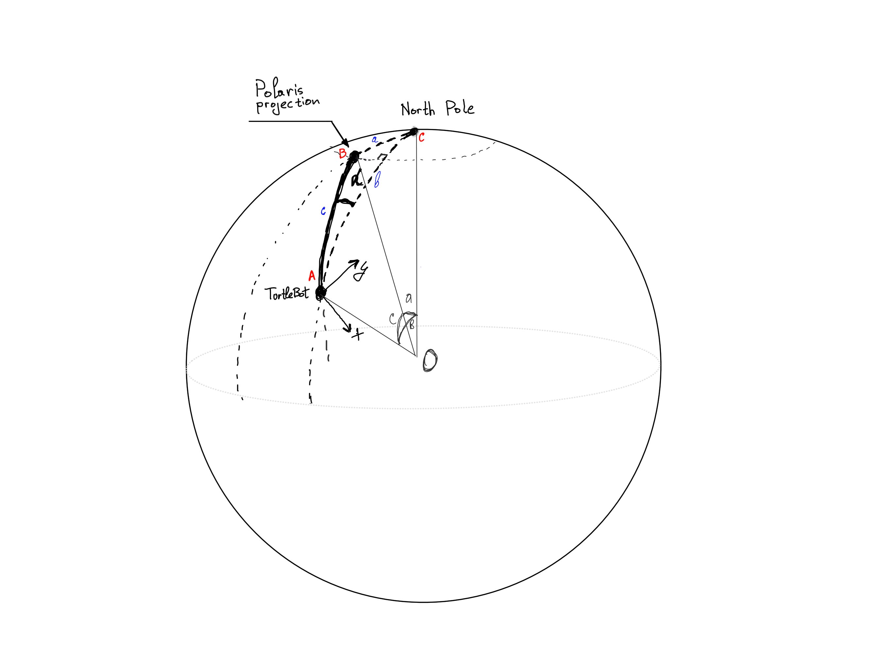

# Coding Assignment: Align the Turtle Bot with Polaris


# How to run

First, [Install Docker](https://docs.docker.com/get-docker/)

Next, donwload [this docker image](https://www.gihub.com/shervlad)

Navigate to the directory where you downloaded the docker image, open a terminal and run 

```
sudo docker load -i turtlebot_docker.tar
```

Now, find what is the image id by running:

```
sudo docker images
```

## Task:

Align the turtlebot robot to point towards the North Star in the sky

### Assumptions:

* The Earth is perfectly spherical
* The origin of our coordinate system is at the center of the Earth, with the z axis being aligned with the Earth's axis and the positive direction of the z axis corresponds to Earth's North. The x axis traverses through Meridian 0 and the y axis through the 90th maridian.


### Approach:
In the real world the robot would have a GPS receiver giving it its exact position on the globe. For this task we will assume that the robot could be anywhere on earth so we will generate random (latitude, longitude, theta). The origin of the robot frame will be at (latitude, longitude), the z axis of the robot will point up and theta will represent the angle between the y axis of the robot and the direction East parallel to the equator. Next, we need to determine the plane of the Polaris Star. More exactly, if we imagine polaris as a distant point in the sky, the task is essentially to align the y axis of the robot with the plane formed by Polaris, the center of the Earth and the TurtleBot. Fortunately, there is a service called [LookUP \(operated by Stuart R. Lowe\)](http://www.strudel.org.uk/lookUP/about.html) and we will use this service to get the coordinates of Polaris.


Once we have the coordinates of Polaris, we need to find the angle that the robot needs to turn in order to align with the Polaris plane. To do that, we first find the angle between the Turtlebod longitude and the Polaris plane intersection (denatoed as alpha, ar A in Fig.2, below)
