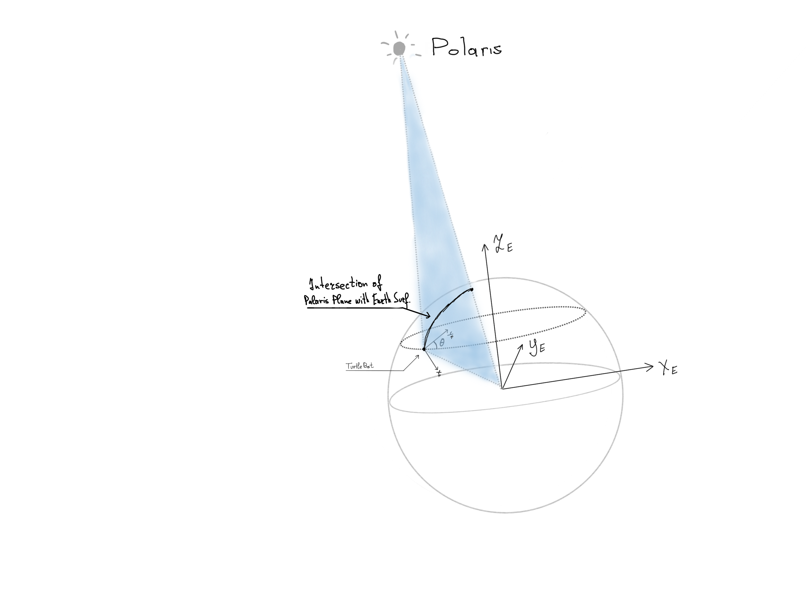

# Coding Assignment: Align the Turtle Bot with Polaris


# How to run it

First, [Install Docker](https://docs.docker.com/get-docker/)

Next, donwload [this docker image](https://www.dropbox.com/s/8lb1agzvdhwhnm4/turtlebot_docker.tar?dl=0)

Navigate to the directory where you downloaded the docker image, open a terminal and run 

```
sudo docker load -i turtlebot_docker.tar
```

Now, find what is the image id by running:

```
sudo docker images
```

then,

```
docker run -it \
    --env="DISPLAY" \
    --env="QT_X11_NO_MITSHM=1" \
    --volume="/tmp/.X11-unix:/tmp/.X11-unix:rw" \
    <YOUR IMAGE ID> \
    bash
```
Now, you should have a docker container which is up and running.

Find the name of your docker container by running:

```
sudo docker ps -a
```

Every time you need to open a bash session inside this docker container, you will open a new terminal and run

```
sudo docker exec -it <CINTAINER NAME> bash
```

Before we proceed to the task itself, I should mention that we will have to open quite a few bash sessions in docker so it's worth adding this to your ~/.bashrc:

```
alias turtle="sudo docker exec -it <CINTAINER NAME> bash"
```

source your ~/.bashrc by running `source ~/.bashrc` and now everytime you want to open a new bash session in docker just type `turtle`


Let's proceed to the actual task now.

First and foremost, let's start the roscore service by running:

```
roscore
```

Next, open a new bash session in this docker container and start the turtlebot gazebo simulation by running:

```
roslaunch turtlebot_gazebo turtlebot_world.launch
```
open another bash session in this container and run

```
roslaunch turtlebot_bringup minimal.launch simulation:=true
```
This starts the all the nodes necessary for receiving commands, publishing and updating transforms and so on.

Next, lets launch the teleop module, which will allow us to control the robot from the keyboard:
Open a new bash session in this docker container and run:

```
roslaunch turtlebot_teleop keyboard_teleop.launch
```
If you want to be able to vizualize the coordinate frames and what the turtlebot is doing in rviz, open a new bash session in the docker container and type:


```
roslaunch way_to_polaris view_turtlebot.launch
```

Finally, let's launch the way_to_polaris nodes that will orient the turtlebot towards Polaris.

Open a new bash session and run:

```
roslaunch way_to_polaris align.launch
```

You should see the robot moving in both gazebo and rviz. And if you go to the terminal where you ran teleop and move the robot around, you should see that it always realigns itself with North. Note that the Y axis of the Odom frame is pointing South.

If you want to see how the robot behaves for different coordinates on earth, modify the `/ros/home/catkin_ws/src/way_to_polaris/launch/params.yaml`, press `Ctrl+C` in the terminal where you typed  `roslaunch way_to_polaris align.launch` and run it again.

# Solution


## Task:

Align the turtlebot robot to point towards the North Star in the sky

### Assumptions:

* The Earth is perfectly spherical
* The orbit of the Earth is a circle
  
### Setting:
* The origin of our coordinate system is at the center of the Earth, with the z axis being aligned with the Earth's axis and the positive direction of the z axis corresponds to Earth's North. The x axis traverses through Meridian 0 and the y axis through the 90th maridian.
* Given (lat,long), the origin of the /odom frame will be at (lat,long) with y pointing south, x - east and z - towards the center of the earth.


### Approach:
In the real world the robot would have a GPS receiver giving it its exact position on the globe. For this task we will assume that the robot could be anywhere on earth so we will set the coordinates manually in the `launch/params.yaml` file. Next, we need to determine the plane of the Polaris Star. More exactly, if we imagine polaris as a distant point in the sky, the task is essentially to align the x axis of the robot with the plane formed by Polaris, the center of the Earth and the TurtleBot.



the `polaris_coords.py` node is responsible for calculating the coordinates of the Polaris projections in Earth's frame and transforming that into the `/odom` frame and publishing on the `/polaris_odom_coords` topic

next, the `polaris_coords_transformer.py` node subsribes to `/polaris_odom_coords` and transforms the coordinates of the polaris projection into the `/base_link` frame and publishes on `/polaris_base_link_coords`. This gives us a vector from the center of the robot to the Polaris projection. Aligning the robot with Polaris essentially means nullifying the y component of this vector. The `align_with_polaris.py` node is responsible for reading from `/polaris_base_link_coords` and turning the robot so as to nullify the y component.

